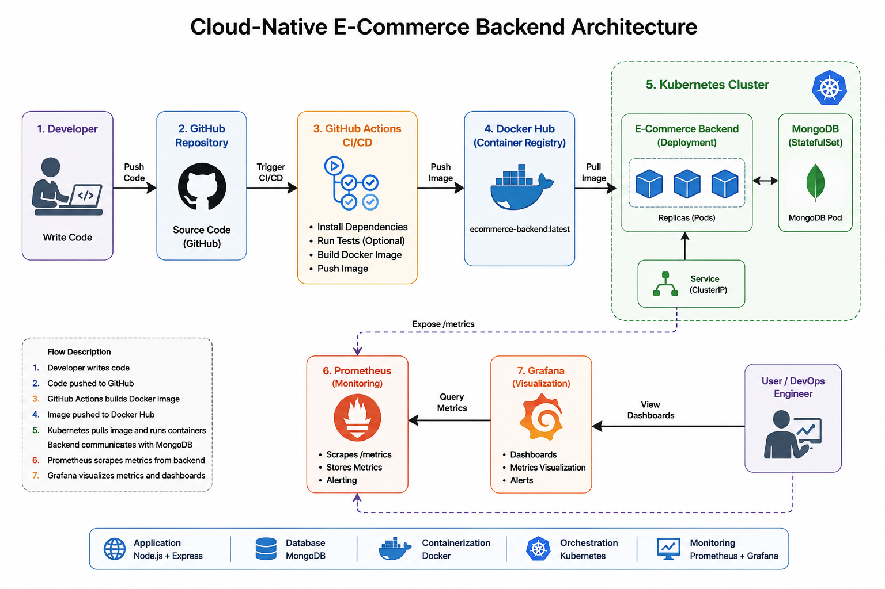
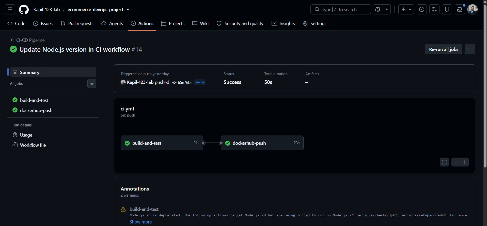
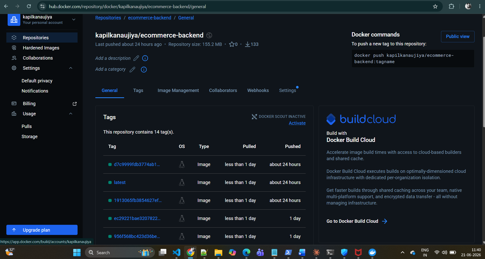
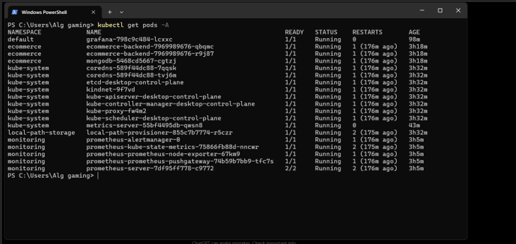
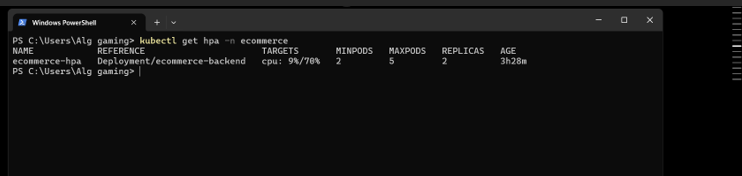
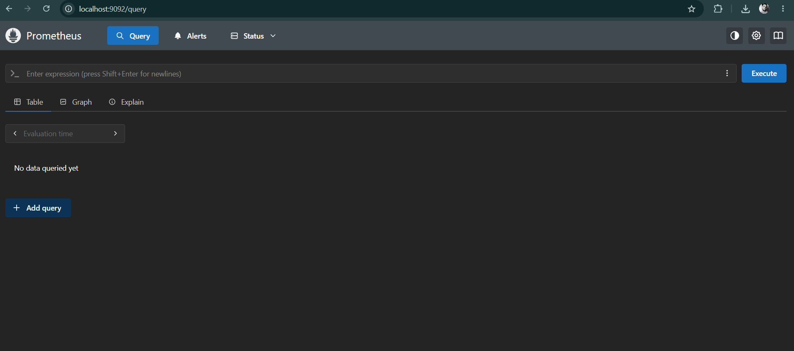
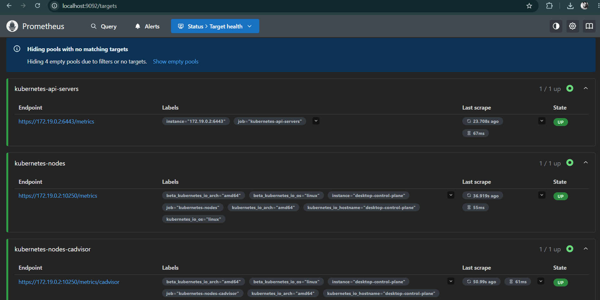
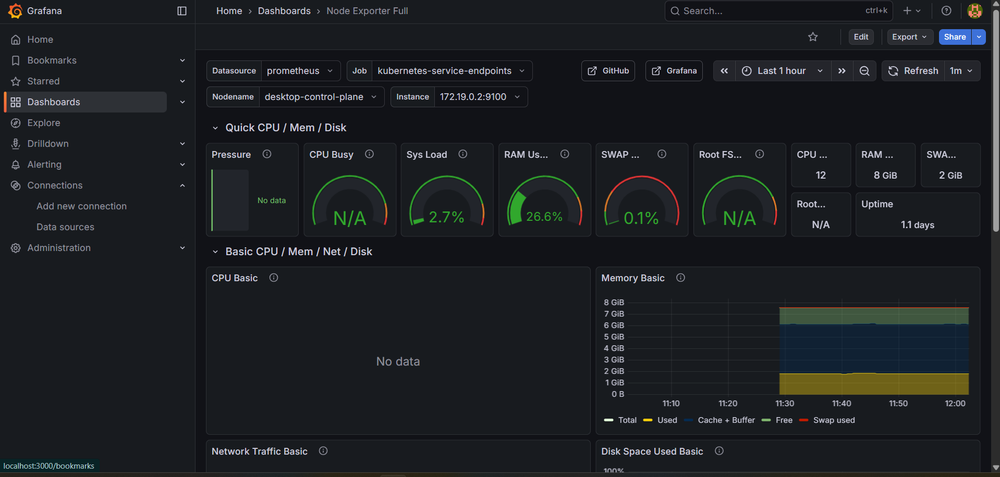

# Cloud-Native E-Commerce Backend Project

## Project Overview

This project demonstrates an end-to-end DevOps implementation for a cloud-native e-commerce backend application. The application is built using Node.js and MongoDB, containerized using Docker, automated through GitHub Actions CI/CD, deployed on Kubernetes, and monitored using Prometheus and Grafana.

The primary objective of this project is to showcase modern DevOps practices including containerization, orchestration, automation, autoscaling, and observability.

---

## Architecture Diagram



```text
Developer
    │
    ▼
GitHub Repository
    │
    ▼
GitHub Actions CI/CD
    │
    ▼
Docker Hub
    │
    ▼
Kubernetes Cluster
    │
 ┌──┴──┐
 ▼     ▼
Backend MongoDB
    │
    ▼
Prometheus
    │
    ▼
Grafana
```

---

## Technology Stack

| Category           | Technology          |
| ------------------ | ------------------- |
| Backend            | Node.js, Express.js |
| Database           | MongoDB             |
| Containerization   | Docker              |
| CI/CD              | GitHub Actions      |
| Container Registry | Docker Hub          |
| Orchestration      | Kubernetes          |
| Monitoring         | Prometheus          |
| Visualization      | Grafana             |
| Autoscaling        | Kubernetes HPA      |

---

## Features

* RESTful APIs for product management
* MongoDB integration
* Dockerized application
* CI/CD pipeline using GitHub Actions
* Docker image publishing to Docker Hub
* Kubernetes deployment and service configuration
* ConfigMap-based configuration management
* Horizontal Pod Autoscaler (HPA)
* Application and infrastructure monitoring using Prometheus and Grafana
* Custom Prometheus metrics exposed via `/metrics`

---

## Project Structure

```bash
ecommerce-devops-project/
│
├── .github/
│   └── workflows/
│       └── ci.yml
│
├── backend/
│   ├── config/
│   ├── controllers/
│   ├── middleware/
│   ├── models/
│   ├── routes/
│   ├── Dockerfile
│   ├── package.json
│   └── server.js
│
├── k8s/
│   ├── deployment.yaml
│   ├── service.yaml
│   ├── configmap.yaml
│   └── hpa.yaml
│
├── docker-compose.yml
└── README.md
```

---

## Local Setup

### Clone Repository

```bash
git clone https://github.com/<your-github-username>/ecommerce-devops-project.git

cd ecommerce-devops-project
```

### Install Dependencies

```bash
cd backend
npm install
```

### Run Application

```bash
npm start
```

Application URLs:

```text
http://localhost:5000
http://localhost:5000/health
http://localhost:5000/api/products
http://localhost:5000/metrics
```

---

## Docker Setup

### Build Docker Image

```bash
docker build -t ecommerce-backend:v1 .
```

### Run Container

```bash
docker run -d --name ecommerce-backend -p 5000:5000 --env-file .env ecommerce-backend:v1
```

### Verify Running Containers

```bash
docker ps
```

---

## Docker Compose

Start Application:

```bash
docker-compose up -d
```

Stop Application:

```bash
docker-compose down
```

---

## CI/CD Pipeline

The project uses GitHub Actions to automate:

* Source code checkout
* Node.js dependency installation
* Docker image build
* Docker Hub authentication
* Docker image push

Pipeline triggers automatically on every push to the `main` branch.

---

## Kubernetes Deployment

Deploy application:

```bash
kubectl apply -f k8s/
```

Verify deployment:

```bash
kubectl get all -n ecommerce
```

View logs:

```bash
kubectl logs <pod-name> -n ecommerce
```

Port forward service:

```bash
kubectl port-forward svc/ecommerce-service 5001:80 -n ecommerce
```

Access application:

```text
http://localhost:5001
```

---

## Horizontal Pod Autoscaler (HPA)

The application automatically scales based on CPU utilization.

Configuration:

* Minimum Pods: 2
* Maximum Pods: 5
* Target CPU Utilization: 70%

Check HPA:

```bash
kubectl get hpa -n ecommerce
```

---

## Monitoring with Prometheus

Install Prometheus using Helm:

```bash
helm install prometheus prometheus-community/prometheus -n monitoring --create-namespace
```

Access Prometheus:

```bash
kubectl port-forward svc/prometheus-server 9090:80 -n monitoring
```

Open:

```text
http://localhost:9090
```

---

## Monitoring with Grafana

Install Grafana:

```bash
helm install grafana grafana/grafana
```

Access Grafana:

```bash
kubectl port-forward svc/grafana 3000:80
```

Open:

```text
http://localhost:3000
```

Default Username:

```text
admin
```

---

## Screenshots

### GitHub Actions Pipeline



### Docker Hub Repository



### Kubernetes Pods



### Horizontal Pod Autoscaler



### Prometheus Dashboard







### Grafana Dashboard



---

## Future Enhancements

* Add React frontend
* Implement Ingress Controller
* Configure TLS using Let's Encrypt
* Deploy on AWS EKS
* Implement GitOps using ArgoCD
* Add centralized logging using ELK Stack

---

## Author

**Kapil Kanaujiya**

Production Support Engineer | DevOps Engineer | SRE Enthusiast

LinkedIn: Add your LinkedIn profile link here
